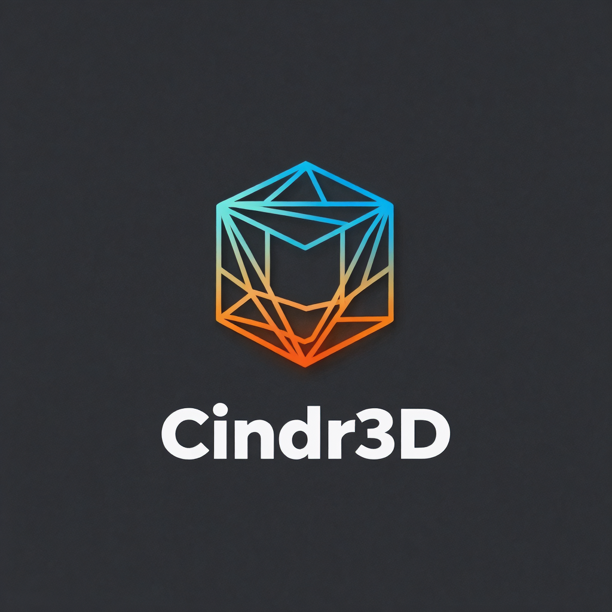

<div align="center">



# Cindr3D

**Browser-based CAD, slicing, and printer control for makers and self-hosted workshops.**

[](LICENSE)
[](https://react.dev/)
[](https://www.typescriptlang.org/)
[](https://vite.dev/)
[](package.json)

Cindr3D brings a professional CAD-style workflow into a web app that can run locally during development or be served from a small Linux board such as an Orange Pi.

</div>

> Cindr3D is not affiliated with Autodesk, Fusion 360, Duet3D, RepRapFirmware, or any slicer vendor.

## Contents

- [Overview](#overview)
- [What's New](#whats-new)
- [Feature Highlights](#feature-highlights)
- [Print Farm Intelligence](#print-farm-intelligence)
- [Cross-Firmware Support](#cross-firmware-support)
- [Tech Stack](#tech-stack)
- [Quick Start](#quick-start)
- [Use Your Own Claude With Cindr3D](#use-your-own-claude-with-cindr3d)
- [Roadmap](#roadmap)
- [Development Scripts](#development-scripts)
- [Project Layout](#project-layout)
- [Production Builds](#production-builds)
- [Orange Pi Hosting](#orange-pi-hosting)
- [Self-Updater Service](#self-updater-service)
- [Release Assets](#release-assets)
- [Quality And Testing](#quality-and-testing)
- [Contributing](#contributing)
- [Security](#security)
- [License](#license)

## Overview

Cindr3D combines design, print preparation, and multi-printer fleet control in one browser workspace. It's designed to run locally during development or be served from a small Linux board (Orange Pi or similar) on your home network — no cloud account required.

| Workspace | Purpose |
|-----------|---------|
| 🎨 **Design** | Sketching, solid modelling, parametric models, configurations, drawings, mesh repair, imports/exports, feature timeline, component organisation. |
| 🛠️ **Prepare** | Plate setup, slicing pipeline with WASM kernel, G-code preview, calibration utilities. |
| 🖨️ **3D Printer** | Multi-printer fleet, live monitoring, files, macros, mid-print object cancellation, tuning, power, spools, timelapse, updates — all cross-firmware. |
| 🤖 **AI** | Local MCP server + BYOK in-app chat panel for driving CAD/slicer/printer actions through your own Claude / OpenAI / OpenRouter subscription. |

The project is evolving quickly. Some CAD and slicer features are experimental, but the repository is public so the implementation can be inspected, used, and improved in the open.

## What's New

> [!NOTE]
> **v0.3.0 — 2026-05-06.** Design workspace, workshop integrations, and operational depth. This release closes the gap between "browser CAD prototype" and a workshop-grade tool: parametric library, design configurations, 2D drawings, mesh repair, non-destructive booleans, plus Discord/Slack/Telegram/MQTT/HomeAssistant bridges, slicer-profile import, power-loss recovery, enclosure safety, and stepper driver tuning.

**Design workspace**

- **Parametric model library** — drop configurable Gridfinity bins, threaded insert bosses, brackets, project boxes, cable clips, and gear blanks straight onto the feature timeline.
- **Design configurations** — named parameter sets with per-variant feature suppression, ribbon switching, and configuration export.
- **Drawing workspace** — auto-generated top/front/right views with inferred dimensions, title block, and SVG/DXF/PDF export.
- **Mesh repair** — manifold report, duplicate-vertex weld, normal repair/flip, auto-fix, and STL import healing.
- **Non-destructive boolean history** — combine features keep parent links and recompute when parents change.
- **Threading library** — metric thread presets with helix geometry and configurable pitch, length, and class.
- **Sketch tangent solving** — the constraint solver now resolves tangents while preserving over-constrained feedback.

**Workshop integrations**

- **Notification bridges** — generic webhooks plus first-class Discord, Slack, Telegram, and MQTT for `PRINT_START`, `LAYER_CHANGE`, `PAUSED`, `FAILED`, `DONE`.
- **Home Assistant bridge** — REST/discovery payloads and remote pause/resume/cancel actions per printer.
- **Slicer profile exchange** — import Cura, OrcaSlicer, Bambu Studio, and 3MF profile data with mapping preview, plus 3MF plate round-trip.
- **Power-loss recovery** — snapshot file, position, Z, layer, bed, and tool state; offer a reconnect resume flow that restores heat/Z and resumes from the saved file position.
- **Enclosure safety** — chamber temperature control, ramp curves, preheat/cooldown, door-open interlock, and MQTT VOC/PM2.5/CO2 thresholds.
- **Stepper driver tuning** — per-axis current, microsteps, StealthChop/SpreadCycle mode, firmware command wrappers, wiggle tests, and per-printer presets.

**Slicer + preview polish**

- **G-code dock panel** — full raw G-code listing with virtual scrolling, click-to-jump, scrub-to-follow, and a breakpoint system for step-by-step inspection.
- **Print Preview dashboard card** — live build plate with object silhouettes, toolpath up to the current layer, and right-click per-object cancel.
- **PTZ camera improvements** — direct command delivery, lower latency, and tighter Reolink/Tapo/Hikvision/Amcrest control.

**Carried forward from v0.2.0**

- AI Assistant (local MCP server + BYOK chat panel), smart print farm queue, all-cameras fleet grid, mid-print object cancellation across all three firmwares, cross-firmware live progress, and the universal tuning UI for Input Shaper / Pressure Advance / Power / Spools / Timelapse / Updates.

## Feature Highlights

### 🎨 CAD & Modelling

- 3D viewport with orbit, pan, zoom, view-cube navigation
- Sketching on XY / XZ / YZ planes with constraint-driven tools (line, circle, rectangle, arc, text)
- Parametric model library for common printable objects and hardware-ready starter geometry
- Design configurations for named variants, parameter sets, feature suppression, and variant export
- Drawing workspace with generated orthographic views, inferred dimensions, title block, SVG / DXF / PDF export
- Solid features: extrude, revolve, sweep, loft, shell, rib, split, draft, hole, thread, chamfer, fillet
- Non-destructive boolean history with visible parent links and recompute when parent meshes change
- Mesh repair tools: manifold report, duplicate vertex weld, normal flip, auto-fix, and STL import healing
- Mesh, surface, construction, inspect, assemble, utilities ribbon areas
- Component tree, feature timeline, selection filters, visibility controls
- Imports: `.f3d`, `.step`, `.stp`, `.stl`, `.obj`; project + settings bundle save/load
- Every CAD action is callable from the local MCP server (29 tools)

### 🛠️ Slicer & Preview

- Plate layout with multi-object support and per-object profile overrides
- WASM-backed geometry kernel (Clipper2, Arachne) for crisp boolean ops and variable-width walls
- Calibration utilities (towers, first-layer test)
- G-code preview with layer slider, simulation playback, wireframe / tube modes, multiple color schemes (type / speed / flow / width / layer-time / wall-quality / seam)
- Bridge skin classification with bridge-fan override
- Print, printer, and material profiles with multi-profile flows
- 🏷️ **`M486` object labels emitted automatically** — mid-print cancellation just works on supported firmware

### 🖨️ Printer Workflows (cross-firmware)

Cindr3D treats Klipper, Duet/RRF, Marlin, Smoothie, grbl, and Repetier as first-class boards. Tabs adapt to whichever board is connected; common features route to firmware-specific commands automatically.

**Integrations and automation**

- Webhook, Discord, Slack, Telegram, and MQTT rules for `PRINT_START`, `LAYER_CHANGE`, `PAUSED`, `FAILED`, and `DONE`.
- MQTT telemetry publishes printer status, temperatures, position, progress, and events at a configurable cadence.
- Home Assistant bridge exposes per-printer REST/discovery payloads and accepts pause/resume/cancel actions.
- Profile import wizard maps Cura, OrcaSlicer, Bambu Studio, and 3MF config fields into Cindr3D print profiles.
- Power-loss recovery snapshots in-progress jobs and offers a guided resume after reconnect.

**Enclosure and safety controls**

- Chamber monitor/control reads RRF chamber heaters, Klipper-style sensors, or generic MQTT temperature topics.
- Chamber targets support ramp curves, print-start preheat, completion cooldown, and door-open cooldown.
- Air-quality card subscribes to VOC, PM2.5, and CO2 MQTT topics with warning and pause thresholds.
- Door/enclosure sensor supports RRF/Klipper GPIO-style model data or direct MQTT reed-switch input with configurable pause/start-lock behavior.
- Stepper Tuning dashboard adjusts per-axis current, microsteps, and StealthChop/SpreadCycle mode, with RRF/Marlin `M906`/`M350`/`M569` and Klipper `SET_TMC_CURRENT` wrappers.

**Mid-print object cancellation** — three places to cancel:

- 🎯 **Exclude Object tab** — full UI with click-to-arm, click-to-confirm cancel; firmware-version badge auto-disables the buttons on too-old firmware
- 📋 **Object Cancellation dashboard card** — compact two-click cancel inline with your other panels
- 🎬 **3D Print Preview viewport** — right-click any object for a context menu with dimensions, position, currently-printing/cancelled status, and a per-object cancel button

**Live print state** is fed in cross-firmware:

- **Duet** — full RRF object-model polling
- **Klipper** — Moonraker `print_stats` + `display_status` polled at 3 s
- **Marlin** — `M73` (`P` / `R` / `Q` / `S`) and `echo:Layer N/M` parsed from the USB serial stream

**Tabs:** Dashboard, Camera, Status, Console, Job, History, Analytics, Files, Macros, Bed Map, Exclude Object, Updates, Power, Input Shaper, Pressure Advance, Spools, Timelapse, Settings (plus Filaments / Object Model / DSF Plugins on Duet only).

## Print Farm Intelligence

Cindr3D now treats the 3D Printer workspace as a small print-farm controller, not just a single-printer monitor.

### Smart Queue

- Persistent queue survives browser restarts and reconciles with each printer's live state.
- Route jobs by build volume, loaded material, nozzle size, printer profile compatibility, and printer availability.
- Split "print N copies" work across multiple printers, then move, pause, cancel, or reorder queued jobs.
- Queue tab provides the full operator view; the fleet dashboard shows a compact next-jobs preview.

### Fleet Cameras

- All Cameras tab shows every enabled camera stream across saved printers with status overlays, ETA/layer context, compact and expanded modes, and click-through to the printer monitor.
- Each printer can store multiple camera streams for top, side, nozzle, or custom views. Dashboard cards can choose which stream to show.
- Camera settings support network cameras, browser USB cameras, server USB cameras, RTSP/HLS/HTTP main streams, WebRTC/WHEP endpoints, and optional ICE/TURN servers for self-hosted remote access.
- WebRTC is tried first when configured for sub-second latency; if the peer connection fails, the camera panel falls back to the existing MJPEG/HLS stream.

### Photo Evidence And PTZ

- Layer Gallery captures per-layer snapshots from enabled cameras, stores them by printer/job/layer in IndexedDB, and exports ZIP archives for later review or vision tooling.
- PTZ controls support Amcrest/Dahua and Reolink commands directly, plus generic/ONVIF/Tapo/Hikvision bridge URL templates.
- Save per-camera PTZ preset slots and mark one as the print-start position so cameras automatically jump to a known first-layer framing.

### Fleet Filament

- Spools roll up by material across the fleet with configurable low-stock thresholds.
- Assign a loaded spool per printer so routing rules and operator views know what each machine can print.
- Completed prints deduct estimated filament from the loaded spool when slicer/firmware metadata includes filament length.

### 🤖 AI Assistant

- 🔗 **Local MCP server** on `:5174` — pair Claude Code with `claude mcp add cindr3d …`
- 🛡️ **Localhost-only**, token-paired, per-tool rate-limited (12 calls / 10 s / tool), 80-entry audit log in the AI status badge
- 💬 **BYOK chat panel** — streaming Anthropic + OpenAI / OpenRouter with full tool-use; 29 tools cover primitives, sketches, features, booleans, transforms, exports, viewport snapshots, and document inspection
- 🔒 Confirmation gate for destructive operations (configurable, off by default)
- ↻ Token rotation from the badge; old tokens invalidate immediately on rotation

### 📡 Self-hosting & deployment

- Static SPA — any static host works; Nginx fallback to `index.html`
- Optional Orange Pi updater service exposing `GET /api/update/status` + `POST /api/update/apply` against the latest GitHub release asset
- WASM artifacts bundled and budget-checked in CI

## Cross-Firmware Support

| Tab / Feature | Klipper | Duet (RRF) | Marlin (USB) | Other |
|---|:---:|:---:|:---:|:---:|
| Dashboard (live) | ✅ | ✅ | ✅ | ✅ |
| Camera | ✅ | ✅ | ✅ | ✅ |
| Files | ✅ | ✅ | — | varies |
| Macros | ✅ | ✅ | — | varies |
| **Exclude Object** | ✅ `EXCLUDE_OBJECT` | ✅ `M486` (3.5+) | ✅ `M486` (2.0.9+) | Workaround page |
| Bed Map | ✅ Moonraker mesh | ✅ heightmap.csv | ✅ G29 | — |
| Input Shaper | ✅ `SET_INPUT_SHAPER` | ✅ `M593` (3.3+) | ✅ `M593` | Notes only |
| Pressure Advance | ✅ `SET_PRESSURE_ADVANCE` | ✅ `M572` | ✅ `M900` | Notes only |
| Power | ✅ Moonraker | ✅ HTTP plugs | ✅ HTTP plugs | ✅ HTTP plugs |
| Spools | ✅ Spoolman bridge | ✅ local | ✅ local | ✅ local |
| Timelapse | ✅ `moonraker-timelapse` | ✅ in-browser | ✅ in-browser | ✅ in-browser |
| Updates | ✅ component + GitHub | ✅ GitHub | ✅ GitHub | ✅ GitHub |
| Integrations | yes MQTT / HA / webhooks | yes MQTT / HA / webhooks | yes MQTT / HA / webhooks | yes MQTT / HA / webhooks |
| Chamber / door / air quality | yes sensors + MQTT | yes heaters/GPIO + MQTT | yes MQTT/manual | yes MQTT/manual |
| Stepper tuning | yes `SET_TMC_CURRENT` | yes `M906` / `M350` / `M569` | yes `M906` / `M350` / `M569` | Notes only |
| Object Model browser | — | ✅ | — | — |
| DSF Plugins | — | ✅ SBC | — | — |

> [!TIP]
> Mid-print cancellation requires labelled G-code. Cindr3D-sliced jobs are labelled automatically. For files from PrusaSlicer / SuperSlicer / OrcaSlicer, enable **Print Settings → Output → Label objects**. For Cura, run the **Label Objects** post-processing script.

## Tech Stack

| Area | Tools |
|------|-------|
| UI | React 19, TypeScript, Lucide React |
| 3D | Three.js, `@react-three/fiber`, `@react-three/drei` |
| State | Zustand |
| Build | Vite 8 |
| Tests | Vitest, Testing Library |
| Quality | ESLint, TypeScript composite builds |
| Geometry/runtime | WASM assets for selected geometry and slicer operations |

## Quick Start

Requirements:

- Node.js `22.12.0` or newer
- npm
- A modern browser with WebGL support

Use the expected Node major version if you have `nvm`:

```bash
nvm use
```

Install dependencies:

```bash
npm ci
```

Start the dev server:

```bash
npm run dev
```

Open:

```text
http://localhost:5173
```

## Use Your Own Claude With Cindr3D

Cindr3D ships with two complementary AI integration paths. Both reuse the same 29-tool MCP surface, so behaviour is identical across them.

### 🔗 Path 1: Pair Claude Code via MCP (recommended)

Run Claude Code locally and add Cindr3D as an MCP server. Your subscription quota covers the conversation; geometry shows up live in the running browser session.

```bash
# Start the dev server
npm run dev

# Open http://localhost:5173, then click the AI MCP status badge
# in the status bar to copy the pairing command:
claude mcp add cindr3d http://localhost:5174/mcp?token=...
```

The browser tab must stay open — tool calls are relayed into the running Cindr3D session.

### 💬 Path 2: BYOK in-app chat panel

For users who prefer not to run Claude Code, the **AI Chat tab** inside Cindr3D provides a streaming chat interface that connects to your own Anthropic, OpenAI, or OpenRouter API key. Set the provider, model, and key in **Global Settings → AI**; the key is stored locally and sent only to your chosen provider.

### 🛡️ Safety & Hardening

- Localhost-only — refuses non-localhost origins
- Token-paired auth, rotateable from the AI status badge
- Per-tool rate limiting (12 calls / 10 s / tool)
- 80-entry audit log of every tool call in the badge popover
- Optional confirmation gate before destructive operations

See [docs/ai-mcp-tools.md](docs/ai-mcp-tools.md) for the tool reference and [docs/ai-examples.md](docs/ai-examples.md) for sample assistant transcripts ("design a phone stand", "add 3 mm fillet to all top edges").

## Roadmap

Shipped and upcoming phases are tracked in [`TaskLists.txt`](TaskLists.txt). What's next:

| Phase | Theme | What lands |
|---|---|---|
| **20** | 🔬 **Printer calibration center** *(planned, XL)* | Closed-loop calibration: card-based wizards for first layer, flow, temperature, retraction, pressure advance, input shaper, dimensional accuracy, and max volumetric speed; pre-built calibration models scaled by nozzle/layer; firmware-specific apply with snapshot/diff/restore safety; camera + AI inspection; rolling 5-result history per printer/material/spool/nozzle/profile. |
| 18 | 🧩 Plugin system | *Future — captured for planning, not yet scheduled.* |

Phases 7–17 and 19 (print-farm intelligence, vision/AI, AR overlay, cost & energy, maintenance, scheduling, integrations, operational polish, slicer fundamentals, design workspace, onboarding, dashboard preview) shipped in `v0.2.0` and `v0.3.0`. See [`TaskLists.txt`](TaskLists.txt) for the full shipped log.

> [!TIP]
> Shipped phases are condensed in [`TaskLists.txt`](TaskLists.txt) with summaries, while active/upcoming phases keep their detailed task lists, effort estimates, file hints, and dependency notes.

## Development Scripts

| Script | Purpose |
|--------|---------|
| `npm run dev` | Start the Vite development server. |
| `npm run dev:fresh` | Clear Vite optimized dependency cache, then start dev server. Useful after dependency, WASM, or persisted-state changes. |
| `npm run build` | Typecheck and build production static files into `dist/`. |
| `npm run preview` | Serve the production build locally with Vite preview. |
| `npm run clean` | Remove `dist/`. |
| `npm run typecheck` | Run the composite TypeScript build check. |
| `npm run lint` | Run ESLint. |
| `npm run test` | Run Vitest in watch mode. |
| `npm run test:run` | Run the Vitest suite once. |
| `npm run test:ui` | Start the Vitest UI. |
| `npm run verify` | Run `tsc -b` and `vitest run`. |
| `npm run check:wasm-budget` | Check WASM asset budget. |
| `npm run verify:wasm-build` | Verify the WASM build artifacts. |

## Project Layout

```text
src/
  app/                 Application shell helpers
  components/          UI components and workspace panels
  engine/              Geometry, import, slicer, and CAD logic
  services/            External/device service integrations
  store/               Zustand stores and slices
  test/                Vitest integration and behavior tests
  types/               Shared TypeScript types
  utils/               Project IO and shared helpers

public/
  fonts/               Runtime font assets

wasm/
  dist/                Tracked WASM runtime artifacts

scripts/
  cindr3d-updater.mjs
  install-orangepi-updater.sh
  check-wasm-budget.mjs
  verify-wasm-build.mjs
```

Ignored local/private folders include `gcodes/`, `.claude/`, `.codex/`, `memory/`, `.gitnexus/`, `obj/`, `node_modules/`, and `dist/`.

## Production Builds

Build static files:

```bash
npm run build
```

Output:

```text
dist/
```

The production build is a static single-page app. Any static host can serve it as long as unknown routes fall back to `index.html`.

## Orange Pi Hosting

Cindr3D can be served from an Orange Pi 3 LTS or similar small Linux board. For small SD cards, build on your development machine and copy only `dist/` to the board.

Recommended base packages:

```bash
sudo apt update
sudo apt full-upgrade -y
sudo apt install -y nginx git curl ufw fail2ban rsync ca-certificates
sudo systemctl enable --now nginx
```

Firewall:

```bash
sudo ufw allow OpenSSH
sudo ufw allow 'Nginx Full'
sudo ufw enable
```

Example Nginx site:

```nginx
server {
    listen 80;
    server_name _;

    root /var/www/cindr3d;
    index index.html;

    location / {
        try_files $uri $uri/ /index.html;
    }

    location /assets/ {
        try_files $uri =404;
        access_log off;
        expires 30d;
        add_header Cache-Control "public, immutable";
    }
}
```

Deploy:

```bash
npm run build
rsync -av --delete dist/ user@device:/var/www/cindr3d/
```

## Self-Updater Service

The repository includes an optional updater service for a self-hosted Orange Pi deployment:

```text
scripts/cindr3d-updater.mjs
scripts/install-orangepi-updater.sh
```

The service exposes local endpoints through Nginx:

| Endpoint | Purpose |
|----------|---------|
| `GET /api/update/status` | Check the installed version against the latest GitHub release. |
| `POST /api/update/apply` | Install the latest release asset. |

The web app includes an **Updates** panel that can talk to this local service.

Install from a checked-out repo on the Pi:

```bash
sudo ./scripts/install-orangepi-updater.sh
```

The installer creates:

```text
/opt/cindr3d/updater/cindr3d-updater.mjs
/etc/cindr3d-updater/updater.env
/etc/cindr3d-updater/token
/var/lib/cindr3d-updater/state.json
cindr3d-updater.service
```

Updater environment variables are documented in `.env.example`. The browser update panel uses the local updater key from `/etc/cindr3d-updater/token`.

## Release Assets

The updater installs only the latest GitHub release asset. It does not update from `master`.

For faster and more reliable device updates, publish a release asset named like:

```text
cindr3d-dist.zip
```

Accepted archive layouts:

```text
index.html
assets/
```

or:

```text
dist/index.html
dist/assets/
```

Release updates download and install already-built static files, avoiding a full `npm ci && npm run build` on the device.

## Quality And Testing

Recommended checks before submitting code:

```bash
npm run typecheck
npm run lint
npm run test:run
npm run build
```

Faster pre-check during development:

```bash
npm run typecheck
npm run lint
```

The slicer and geometry tests are intentionally detailed because small numerical changes can affect generated toolpaths, preview alignment, or dimensional accuracy.

## GitNexus Code Intelligence

This repository includes `AGENTS.md` instructions for GitNexus-assisted code navigation and impact analysis.

Useful commands:

```bash
npm run graph:analyze
npm run graph:list
npm run graph:serve
```

When changing functions, classes, or methods, follow the GitNexus impact-analysis guidance in `AGENTS.md`.

## Contributing

Start with:

- `CONTRIBUTING.md`
- `CODE_OF_CONDUCT.md`
- `SECURITY.md`

Good contributions include:

- focused bug fixes
- tests for slicer/geometry edge cases
- importer/exporter improvements
- viewport interaction fixes
- printer workflow improvements
- documentation that helps new users run or self-host the app

## Security

Please do not report security issues in public issues. See `SECURITY.md`.

Never commit:

- printer credentials
- Wi-Fi credentials
- updater keys
- GitHub tokens
- local G-code test files
- generated caches
- private project files

## License

Cindr3D is released under the MIT License. See `LICENSE`.

The bundled Roboto font is licensed separately by Google under Apache-2.0. See `THIRD_PARTY_NOTICES.md`.

