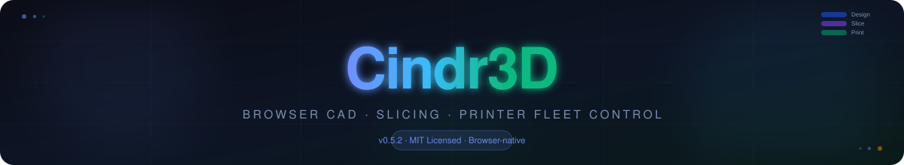

<div align="center">



<br/>

[](https://cindr3d.com/)
[](https://github.com/exzile/Cindr3D/releases/tag/v0.5.2)
[](LICENSE)

<br/>


<br/>

**[⚡ Quick Start](#-quick-start)** &nbsp;·&nbsp;
**[🚀 v0.5.2](#-whats-new-in-v052)** &nbsp;·&nbsp;
**[🛠 Capabilities](#-capabilities)** &nbsp;·&nbsp;
**[🖨 Printer Support](#-printer-support)** &nbsp;·&nbsp;
**[🤖 AI & Automation](#-ai--automation)** &nbsp;·&nbsp;
**[🌐 Self-Hosting](#-self-hosting)**

</div>

<br/>


<br/>

> Cindr3D is not affiliated with Autodesk, Fusion 360, Duet3D, RepRapFirmware, or any slicer vendor.

Cindr3D combines a CAD-style design workspace, in-browser slicing, and multi-printer fleet control into one browser app — no cloud upload, no install, no account required. It runs locally for development, from any static web host, or from a small Linux board on your workshop network.

<table>
  <tr>
    <td width="25%" align="center">🎨<br/><b>Design</b><br/><sub>OpenCascade-backed sketches, B-rep solids, timeline, configurations, import/export</sub></td>
    <td width="25%" align="center">⚙️<br/><b>Prepare</b><br/><sub>Plate layout, WASM slicer, G-code preview, calibration models, print profiles</sub></td>
    <td width="25%" align="center">🖨<br/><b>Operate</b><br/><sub>Dashboards, cameras, macros, files, spools, power, calibration, printer history</sub></td>
    <td width="25%" align="center">🤖<br/><b>Automate</b><br/><sub>BYOK chat, local MCP tools, audit log, token pairing, safety gates</sub></td>
  </tr>
</table>


## ⚡ Quick Start

**Requirements:** Node.js `≥ 22.12.0` · npm · A modern browser with WebGL

```bash
nvm use
npm ci
npm run dev
```

```
http://localhost:5173
```

| Goal | Path |
|---|---|
| 🎨 Build a model | `Design` → create a sketch → extrude a profile |
| 🔧 Inspect slicing | `Prepare` → import a model → open G-code preview |
| 🖨 Add a printer | `3D Printer` → add connection → open dashboard |
| 🤖 Pair AI tools | Open the AI MCP badge → copy the local pairing command |

**Before contributing:**

```bash
npm run typecheck   # TS composite build check
npm run lint        # ESLint
npm run test:run    # Vitest once
npm run build       # Full production build
```


## 🚀 What's New in v0.5.2

Design workspace release — sketch parity, primitive UX, and performance. Ships in PRs [#78](https://github.com/exzile/Cindr3D/pull/78) and [#79](https://github.com/exzile/Cindr3D/pull/79).

| Area | Change |
|---|---|
| 🪞 **Sketch mirror** | Mirror any selection of entities across a chosen sketch line. Handles lines, arcs, circles, splines, and rectangles. |
| ✏️ **Sketch text** | Parametric text with Roboto Regular/Bold/Italic (3 families). Generates extrudable closed-spline contours; double-click to edit. Text-on-path included. |
| 🖐 **Point drag handles** | Fusion-style handles on every entity point type — line endpoints, arc centre/ends, spline knots — reshape geometry directly in the viewport. |
| 📐 **Advanced constraints** | G2+ smooth continuity, offset curves dimension, tangent-distance dimension, angular solver, fixed spline type, break-link, H/V points, autoConstrain. |
| 📏 **Cylinder dimension labels** | Floating dimension badges on cylinder drag handles: cyan `20.00 mm` on height, orange `Ø 40.00 mm` on diameter. Live during drag, directly editable. |
| 📦 **Primitive operations** | Box, Cylinder, Sphere, Torus now support Join, Cut, Intersect, New Component. Coil and Pipe completed to Fusion field parity. All dialogs reopen from timeline. |
| ⚡ **Viewport performance** | Fixed a `pointermove` listener leak per sketch-interaction mount. Demand-driven re-renders cut idle CPU on complex assemblies. |
| 🎛 **Toolbar overflow** | `⋯` overflow button when ribbon tools don't fit; active tool auto-promotes into the visible ribbon slot. Flyout close-timing fixed. |
| 🧪 **Tests** | 3 new test files: corner editing commit, corner fillet geometry, fillet-radius round-trips. Extended mirror/arc solver coverage. |

<details>
<summary><b>v0.5.0 / v0.5.1 foundation</b></summary>

**v0.5.1** — Polygon side-count glyphs, compact timeline, polished ribbon/dropdowns, draggable configuration modal, batched constraint glyphs, camera-idle redraws.

**v0.5.0** — OpenCascade modeling core (extrude, revolve, sweep, loft, primitives, booleans, split, shell, draft, offset faces, fillet, chamfer), topology-aware fillet/chamfer edge metadata, profile-aware extrude selection, DZND project persistence, search/sitemap/robots/Azure headers.

</details>


## 🛠 Capabilities

<details>
<summary><b>🎨 CAD and Modeling</b></summary>

- Orbit/pan/zoom viewport with view-cube navigation
- Sketching on standard planes and construction planes
- Constraint-driven sketch tools: lines, rectangles, circles, arcs, splines, polygons, slots, text, projections, intersections
- **Sketch mirror**, **text and text-on-path**, **point drag handles**, G2+ continuity, offset curves, angular solver
- OCC-backed features: extrude, revolve, sweep, loft, shell, rib, split, draft, offset faces, hole, thread, chamfer, fillet, move, align, merge faces, and primitives
- Profile-aware extrude selection for nested sketch regions and holes
- Topology-aware fillet/chamfer with stable edge anchors and circular-edge handling
- Component tree, compact timeline, configuration variants, selection filters, visibility controls
- Imports: `.f3d`, `.step`, `.stp`, `.stl`, `.obj`; project/settings save and load

</details>

<details>
<summary><b>⚙️ Slicer and Preview</b></summary>

- Multi-object plate layout with per-object profile overrides
- WASM-backed slicer: layer height, speed, temperature, walls, infill, supports, seam, retraction
- Tree supports, adaptive layer heights, multi-color slicing, scarf seam, vase mode, fuzzy skin
- Arachne variable-width perimeter walls for accurate thin-feature reproduction
- 8 layer processor types: tuning tower, change-at-Z, pause-at-Z, filament change, timelapse, custom G-code, search/replace (regex), print-from-height
- Animated G-code preview with layer scrubbing, move-type color coding, per-layer time and filament estimates
- G-code dock panel synchronized with 3D preview
- Automatic `M486` / `EXCLUDE_OBJECT` labels for object cancellation

</details>

<details>
<summary><b>🖨 Printer Workflows</b></summary>

- Fleet dashboard, printer dashboard, camera, status, console, job, history, analytics, files, macros, bed map, updates, power, input shaper, pressure advance, spools, timelapse tabs
- Smart queue routing by machine, material, nozzle, volume, and profile compatibility
- Multiple camera streams per printer, WebRTC fallback, ONVIF PTZ presets, layer evidence capture
- Webhooks, Discord, Slack, Telegram, MQTT, Home Assistant, power-loss recovery, chamber controls, air-quality monitors
- 9-type calibration center with guided wizard, in-wizard 3D preview, per-firmware apply + rollback, and calibration aging tracker

</details>

<details>
<summary><b>🤖 AI and Automation</b></summary>

- Local MCP server with 29 tools: parametric primitives, sketch creation, feature operations, boolean history, transforms, slicer profile control, slice execution, printer commands
- BYOK in-app chat: Anthropic, OpenAI, OpenRouter — keys are session-only
- AI print diagnostics: aggregates camera frames, temperature graphs, firmware errors into a ranked probable-cause list
- Natural-language printer control with configurable confirmation gates for destructive actions
- Token-paired auth, 80-entry audit log, per-tool rate limiting, localhost-only MCP bridge

</details>


## 🖨 Printer Support

| Feature | Klipper | Duet / RRF | Marlin USB | Other |
|---|:---:|:---:|:---:|:---:|
| Dashboard | ✅ | ✅ | ✅ | ✅ |
| Camera | ✅ | ✅ | ✅ | ✅ |
| Files | ✅ | ✅ | limited | varies |
| Macros | ✅ | ✅ | limited | varies |
| Exclude object | `EXCLUDE_OBJECT` | `M486` | `M486` | workaround |
| Bed map | Moonraker mesh | `heightmap.csv` | `G29` | varies |
| Input shaper | `SET_INPUT_SHAPER` | `M593` | `M593` | notes |
| Pressure advance | `SET_PRESSURE_ADVANCE` | `M572` | `M900` | notes |
| Power / updates / spools | ✅ | ✅ | ✅ | ✅ |
| Object model / DSF plugins | — | ✅ | — | — |

> Mid-print cancellation requires labelled G-code. Cindr3D-sliced jobs are labelled automatically. For external slicers, enable object labels or equivalent post-processing.


## 🤖 AI & Automation

Two integration paths backed by the same local tool surface:

| Path | Best for |
|---|---|
| **Claude Code via MCP** | Local CAD/printer automation while the browser session is open — pair through the AI MCP badge |
| **BYOK in-app chat** | In-browser assistant — Anthropic, OpenAI, and OpenRouter keys, session-only |

**Safety defaults:** Localhost-only MCP bridge · Token-paired auth with rotation · Per-tool rate limiting · 80-entry audit log · Optional confirmation before destructive operations

See [docs/ai-mcp-tools.md](docs/ai-mcp-tools.md) for tool details and [docs/ai-examples.md](docs/ai-examples.md) for example workflows.


## 🏗 Tech Stack

<div align="center">

**Core**


**3D / Geometry**


**State / Quality**


</div>


## 📂 Project Layout

```text
src/
  components/      UI components, dialogs, panels, viewport
  engine/          CAD, geometry, OCC, slicer, import/export logic
  services/        Device and integration services
  store/           Zustand stores and CAD/printer slices
  test/            Vitest behavior and regression tests
  types/           Shared TypeScript models
  utils/           Shared helpers and project IO

public/            Static assets, fonts, icons, help screenshots
wasm/              Tracked WASM runtime artifacts
scripts/           Build, updater, SEO, and verification scripts
docs/              Help, AI/MCP, deployment, and technical docs
```

| Script | Purpose |
|---|---|
| `npm run dev` | Start Vite development server |
| `npm run dev:fresh` | Clear Vite cache then start dev server |
| `npm run build` | Typecheck, build static files, and generate SEO pages |
| `npm run typecheck` | Run the composite TypeScript build check |
| `npm run lint` | Run ESLint |
| `npm run test:run` | Run Vitest once |
| `npm run verify` | Run `tsc -b` and `vitest run` |


## 🌐 Self-Hosting

Cindr3D is a static single-page app. Any static host works if unknown routes fall back to `index.html`.

```bash
npm run build   # outputs to dist/
```

**Minimal Nginx:**

```nginx
server {
    listen 80;
    root /var/www/cindr3d;
    index index.html;
    location / { try_files $uri $uri/ /index.html; }
    location /assets/ { expires 30d; add_header Cache-Control "public, immutable"; }
}
```

```bash
rsync -av --delete dist/ user@device:/var/www/cindr3d/
```

<details>
<summary><b>Orange Pi auto-updater service</b></summary>

The repository includes `scripts/cindr3d-updater.mjs` and `scripts/install-orangepi-updater.sh` for self-hosted devices:

| Endpoint | Purpose |
|---|---|
| `GET /api/update/status` | Compare installed version with the latest GitHub release |
| `POST /api/update/apply` | Install the latest release asset (`cindr3d-dist.zip`) |

The updater installs release assets — it does not update directly from `master`.

</details>


## 🗺 Roadmap

Active work is tracked in [TaskLists.txt](TaskLists.txt).

| Theme | Focus |
|---|---|
| 🎨 **Sketch parity** | Face-placement for primitives, DOF coloring, offset/break tools, constraint inference guides |
| 🔷 **OCC edge topology** | Fillet/chamfer selection fully OCC-topology-backed from render through commit |
| 📷 **Camera-assisted calibration** | Vision models for first-layer, ringing, and stringing analysis |
| 🔌 **Plugin system** | Registry-based architecture for third-party CAD, slicer, and printer panel extensions |

## 🏷 GitNexus Code Intelligence

This repository is indexed by GitNexus for symbol-level navigation and impact analysis. See [AGENTS.md](AGENTS.md) for guidance.

```bash
npm run graph:analyze   # index the codebase
npm run graph:list      # list indexed repos
npm run graph:serve     # start the GitNexus server
```

Before modifying any function, class, or method, run impact analysis as described in [AGENTS.md](AGENTS.md).


## 🤝 Contributing

Start with [CONTRIBUTING.md](CONTRIBUTING.md), [CODE_OF_CONDUCT.md](CODE_OF_CONDUCT.md), and [SECURITY.md](SECURITY.md).

Good contributions include focused bug fixes, geometry/slicer edge-case tests, importer/exporter improvements, viewport interaction fixes, printer workflow improvements, and documentation that helps users run or self-host the app.

## 🔒 Security

Please do not report security issues in public issues. See [SECURITY.md](SECURITY.md).

Never commit printer credentials, Wi-Fi credentials, updater keys, GitHub tokens, local G-code test files, generated caches, or private project files.

## 📄 License

Cindr3D is released under the **MIT License**. See [LICENSE](LICENSE).

The bundled Roboto font is licensed separately by Google under Apache-2.0. See [THIRD_PARTY_NOTICES.md](THIRD_PARTY_NOTICES.md).

<br/>

<div align="center">


<sub>Made with ☕ · MIT licensed · No telemetry · No cloud · <a href="https://cindr3d.com">cindr3d.com</a></sub>

</div>
