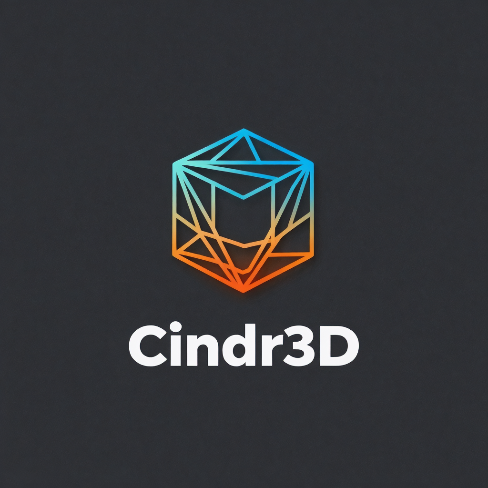

<div align="center">



# Cindr3D

**Browser CAD, slicing, and printer fleet control for makers and self-hosted workshops.**

<p>
  <a href="https://cindr3d.com/"></a>
  <a href="https://github.com/exzile/Cindr3D/releases/tag/v0.5.2"></a>
  <a href="LICENSE"></a>
</p>

<p>
  
  
  
  
  
</p>



<p>
  <a href="#quick-start"><strong>Quick start</strong></a> |
  <a href="#release-052"><strong>v0.5.2</strong></a> |
  <a href="#capabilities"><strong>Capabilities</strong></a> |
  <a href="#printer-support"><strong>Printer support</strong></a> |
  <a href="#ai-and-automation"><strong>AI</strong></a> |
  <a href="#self-hosting"><strong>Self-hosting</strong></a>
</p>

</div>

> Cindr3D is not affiliated with Autodesk, Fusion 360, Duet3D, RepRapFirmware, or any slicer vendor.

## Overview

Cindr3D combines a CAD-style design workspace, slicing/prep tools, and multi-printer operations into one browser app. It can run locally for development, from a static web host, or from a small Linux board such as an Orange Pi on a workshop network.

<table>
  <tr>
    <td width="25%"><strong>Design</strong><br>OpenCascade-backed sketches, B-rep solids, timeline edits, profiles, configurations, and import/export flows.</td>
    <td width="25%"><strong>Prepare</strong><br>Plate layout, slicer kernels, G-code simulation, calibration models, print profiles, and preview tooling.</td>
    <td width="25%"><strong>Operate</strong><br>Dashboards, cameras, macros, files, spools, power, updates, calibration, and printer history.</td>
    <td width="25%"><strong>Automate</strong><br>BYOK chat, local MCP tools, audit logs, token pairing, and safety gates for destructive actions.</td>
  </tr>
</table>

## Who It Is For

| Reader | Start here | What to look for |
|---|---|---|
| **Maker or shop operator** | [Live site](https://cindr3d.com/) or [Quick Start](#quick-start) | Printer dashboards, profiles, calibration, camera workflows, and queue/fleet tools. |
| **CAD contributor** | [Release 0.5.2](#release-052), [Capabilities](#capabilities), [TaskLists.txt](TaskLists.txt) | Sketch parity, primitive UX, OCC modeling, constraint solver, and topology tasks. |
| **Self-hosting user** | [Self Hosting](#self-hosting) | Static deployment, Orange Pi updater service, release assets, and local-only operation. |
| **AI/MCP user** | [AI and Automation](#ai-and-automation) | Claude Code pairing, BYOK chat, tool audit logs, token rotation, and safety gates. |

> Project maturity: Cindr3D is moving quickly. Printer workflows and hosted docs are usable today; CAD/OCC tooling is under active development and should be treated as experimental for production-critical designs.

## Quick Start

Requirements:

- Node.js `22.12.0` or newer
- npm
- A modern browser with WebGL support

```bash
nvm use
npm ci
npm run dev
```

Open:

```text
http://localhost:5173
```

After the app opens, try one of these first:

| Goal | Path |
|---|---|
| Build a model | `Design` workspace -> create a sketch -> extrude a profile. |
| Inspect slicing | `Prepare` workspace -> import a model -> open the G-code preview/simulation. |
| Add a printer | `Printer` workspace -> add connection -> open dashboard/settings. |
| Pair AI tools | Open the AI MCP badge -> copy the local pairing command. |

Common checks before contributing:

```bash
npm run typecheck
npm run lint
npm run test:run
npm run build
```

## Release 0.5.2

**v0.5.2** is a focused Design workspace release covering sketch parity, primitive UX, and performance. All changes shipped in PRs #78 and #79.

| Area | Highlights |
|---|---|
| **Sketch mirror** | Mirror any selection of entities across a chosen sketch line. Handles lines, arcs, circles, splines, and rectangles while preserving constraint relationships. |
| **Sketch text** | Parametric text with Roboto Regular/Bold/Italic across three families. Text generates extrudable closed-spline contours; double-click to edit. Text-on-path support included. |
| **Sketch point handles** | Fusion-style drag handles on every entity point type — line endpoints, arc centre/ends, spline knots — reshape geometry directly in the viewport while the constraint solver keeps connections consistent. |
| **Advanced constraints** | G2+ smooth continuity, offset curves dimension, tangent-distance dimension, angular solver, fixed spline type, break-link, H/V points constraint, and autoConstrain on solve. Break/split arc and real cubic B-spline entity type. |
| **Cylinder dimension labels** | Drag-handle badges matching Fusion's manipulator UX: a cyan `20.00 mm` badge on the height arrow and an orange `Ø 40.00 mm` badge on the diameter arrow. Both update live during drag and are directly editable. |
| **Primitive operations** | Box/Cylinder/Sphere/Torus now fully support Join, Cut, Intersect, and New Component operations against existing bodies. Coil and Pipe dialogs completed to Fusion field parity. All primitive dialogs reopen from the timeline. |
| **Viewport performance** | Fixed a pointermove listener leak that accumulated on each sketch-interaction mount. Demand-driven re-renders cut idle CPU on complex assemblies. Batched constraint glyph renders. |
| **Toolbar polish** | RibbonSection overflow button (⋯) when tools don't fit; active tool auto-promotes into the visible ribbon. Flyout close-timing fix prevents stray menu portals intercepting canvas clicks after item selection. |
| **Tests** | Three new test files: corner editing commit, corner fillet geometry (tangent-point reconstruction), and fillet-radius update round-trips. Mirror and arc solver edge cases added to the existing suite. |

<details>
<summary><strong>v0.5.1 and v0.5.0 foundation</strong></summary>

**v0.5.1:**
- Polygon side-count glyphs, refined sketch coloring, delete/context-menu flows.
- Compact modern timeline, polished ribbon/dropdowns, draggable configuration modal.
- Reduced sketch-overlay work while panning, batched constraint glyphs, camera-idle redraws.

**v0.5.0:**
- OpenCascade modeling core for extrude, revolve, sweep, loft, primitives, booleans, split, shell, draft, offset faces, fillet, and chamfer.
- Topology-aware fillet/chamfer edge metadata, stable edge anchors, circular-edge support, tangent-chain support, and validity probes.
- Profile-aware extrude selection for nested sketch regions: plates with holes, inner islands, or targeted cuts.
- DZND project persistence for OCC metadata, profile selections, edge-mod inputs, feature parameters, and reconstruction data.
- Search metadata, sitemap, robots, Static Web Apps rewrites, Azure headers, and expanded tests.

</details>

## Capabilities

| Workspace | What it gives you |
|---|---|
| **CAD and modeling** | 3D viewport, sketches, constraints, OCC solids, profile extrude, edge picking, booleans, timeline, components, drawings, imports, exports. |
| **Slicer and preview** | Plate layout, WASM geometry kernels, G-code preview, simulation playback, bridge/wall visualization, profiles, calibration generators. |
| **Printer control** | Cross-firmware dashboards, camera streams, console, files, macros, jobs, history, analytics, bed maps, input shaping, pressure advance, spools, power, updates. |
| **AI assistant** | Local MCP bridge, BYOK chat, 29 tool calls, token pairing, audit log, rate limiting, and optional confirmation for destructive tools. |

<details>
<summary><strong>Detailed feature list</strong></summary>

### CAD and Modeling

- Orbit/pan/zoom viewport with view-cube navigation.
- Sketching on standard planes and construction planes.
- Constraint-driven sketch tools for lines, rectangles, circles, arcs, splines, polygons, slots, text, projections, and intersections.
- OCC-backed features: extrude, revolve, sweep, loft, shell, rib, split, draft, offset faces, hole, thread, chamfer, fillet, move, align, merge faces, and primitives.
- Profile-aware extrude selection for nested sketch regions and holes.
- Topology-aware fillet/chamfer selection with stable edge anchors and circular-edge handling.
- Component tree, compact timeline, configuration variants, selection filters, and visibility controls.
- Imports: `.f3d`, `.step`, `.stp`, `.stl`, `.obj`; project/settings bundle save and load.

### Slicer and Preview

- Multi-object plate layout with per-object profile overrides.
- WASM-backed geometry paths for boolean and slicing support.
- G-code preview with layer slider, simulation playback, tube/wireframe modes, and multiple color schemes.
- Bridge skin classification, object labels, calibration generators, print profiles, printer profiles, and material profiles.
- Automatic `M486` object labels for supported firmware object cancellation.

### Printer Workflows

- Fleet dashboard, printer dashboard, camera, status, console, job, history, analytics, files, macros, bed map, updates, power, input shaper, pressure advance, spools, timelapse, and settings tabs.
- Smart queue routing by machine, material, nozzle, volume, profile compatibility, and availability.
- Multiple camera streams per printer, WebRTC fallback, PTZ presets, and layer evidence capture.
- Webhooks, Discord, Slack, Telegram, MQTT, Home Assistant, power-loss recovery, chamber controls, door sensors, and air-quality monitors.

</details>

## Printer Support

| Feature | Klipper | Duet / RRF | Marlin USB | Other |
|---|:---:|:---:|:---:|:---:|
| Dashboard | yes | yes | yes | yes |
| Camera | yes | yes | yes | yes |
| Files | yes | yes | limited | varies |
| Macros | yes | yes | limited | varies |
| Exclude object | `EXCLUDE_OBJECT` | `M486` | `M486` | workaround |
| Bed map | Moonraker mesh | `heightmap.csv` | `G29` | varies |
| Input shaper | `SET_INPUT_SHAPER` | `M593` | `M593` | notes |
| Pressure advance | `SET_PRESSURE_ADVANCE` | `M572` | `M900` | notes |
| Power / updates / spools | yes | yes | yes | yes |
| Object model / DSF plugins | no | yes | no | no |

> Mid-print cancellation requires labelled G-code. Cindr3D-sliced jobs are labelled automatically. For external slicers, enable object labels or equivalent post-processing.

## AI and Automation

Cindr3D has two AI integration paths backed by the same local tool surface.

| Path | Best for | Notes |
|---|---|---|
| **Claude Code via MCP** | Local CAD/printer automation while the browser session is open | Pair through the AI MCP badge; tool calls relay into the running app. |
| **BYOK in-app chat** | Users who want an in-browser assistant | Supports Anthropic, OpenAI, and OpenRouter keys; keys are session-only. |

Safety defaults:

- Localhost-only MCP bridge.
- Token-paired auth with rotation from the status badge.
- Per-tool rate limiting.
- 80-entry audit log.
- Optional confirmation before destructive operations.

See [docs/ai-mcp-tools.md](docs/ai-mcp-tools.md) for tool details and [docs/ai-examples.md](docs/ai-examples.md) for example workflows.

## Tech Stack

| Layer | Tools |
|---|---|
| UI | React 19, TypeScript, Lucide React |
| 3D | Three.js, `@react-three/fiber`, `@react-three/drei` |
| State | Zustand |
| Build | Vite 8 |
| Tests | Vitest, Testing Library |
| Geometry | OpenCascade WASM plus slicer/preview WASM kernels |
| Quality | ESLint, TypeScript composite builds, GitNexus code intelligence |

## Project Layout

```text
src/
  components/      UI components, dialogs, panels, viewport
  engine/          CAD, geometry, OCC, slicer, import/export logic
  services/        Device and integration services
  store/           Zustand stores and CAD/printer slices
  test/            Vitest behavior and regression tests
  types/           Shared TypeScript models
  utils/           Shared helpers and project IO

public/            Static assets, icons, help screenshots
wasm/              Tracked WASM runtime artifacts
scripts/           Build, updater, SEO, and verification scripts
docs/              Help, AI/MCP, deployment, and technical docs
```

## Development Scripts

| Script | Purpose |
|---|---|
| `npm run dev` | Start Vite development server. |
| `npm run dev:fresh` | Clear Vite optimized dependency cache, then start dev server. |
| `npm run build` | Typecheck, build static files, and generate SEO pages. |
| `npm run preview` | Preview the production build locally. |
| `npm run typecheck` | Run the composite TypeScript build check. |
| `npm run lint` | Run ESLint. |
| `npm run test:run` | Run Vitest once. |
| `npm run verify` | Run `tsc -b` and `vitest run`. |
| `npm run check:wasm-budget` | Check WASM asset budget. |
| `npm run verify:wasm-build` | Verify WASM build artifacts. |

## Self Hosting

Cindr3D is a static single-page app. Any static host works if unknown routes fall back to `index.html`.

```bash
npm run build
```

Output:

```text
dist/
```

Minimal Nginx pattern:

```nginx
server {
    listen 80;
    server_name _;
    root /var/www/cindr3d;
    index index.html;

    location / {
        try_files $uri $uri/ /index.html;
    }

    location /assets/ {
        try_files $uri =404;
        access_log off;
        expires 30d;
        add_header Cache-Control "public, immutable";
    }
}
```

Deploy:

```bash
rsync -av --delete dist/ user@device:/var/www/cindr3d/
```

<details>
<summary><strong>Optional Orange Pi updater service</strong></summary>

The repository includes an updater for self-hosted devices:

```text
scripts/cindr3d-updater.mjs
scripts/install-orangepi-updater.sh
```

Endpoints:

| Endpoint | Purpose |
|---|---|
| `GET /api/update/status` | Compare installed version with the latest GitHub release. |
| `POST /api/update/apply` | Install the latest release asset. |

The updater installs release assets such as `cindr3d-dist.zip`; it does not update directly from `master`.

</details>

## Roadmap

Active work is tracked in [TaskLists.txt](TaskLists.txt). Current themes:

| Theme | Focus |
|---|---|
| **Dependency maintenance** | Safe npm update batch, audit fixes, and viewport-sensitive package review on `Dev1`. |
| **Sketch parity** | Offset/break tools, additional constraints, DOF coloring, constraint glyphs, and inference guides. |
| **OCC edge topology** | Make fillet/chamfer selection fully OCC-topology-backed from render through commit. |
| **Primitive parity** | Modern primitive dialogs, operation selection, diameter-based fields, edit mode, live preview, and pipe/coil parity. |
| **Calibration and printer QA** | Camera-assisted calibration, printer page smoke tests, and calibration dashboard stability. |

## Release Assets

For faster self-hosted updates, publish a release asset named like:

```text
cindr3d-dist.zip
```

Accepted archive layouts:

```text
index.html
assets/
```

or:

```text
dist/index.html
dist/assets/
```

## GitNexus Code Intelligence

This repository includes GitNexus-assisted navigation and impact-analysis instructions in [AGENTS.md](AGENTS.md).

```bash
npm run graph:analyze
npm run graph:list
npm run graph:serve
```

When changing functions, classes, or methods, follow the GitNexus impact-analysis guidance in [AGENTS.md](AGENTS.md).

## Contributing

Start with [CONTRIBUTING.md](CONTRIBUTING.md), [CODE_OF_CONDUCT.md](CODE_OF_CONDUCT.md), and [SECURITY.md](SECURITY.md).

Good contributions include focused bug fixes, tests for geometry/slicer edge cases, importer/exporter improvements, viewport interaction fixes, printer workflow improvements, and documentation that helps users run or self-host the app.

## Security

Please do not report security issues in public issues. See [SECURITY.md](SECURITY.md).

Never commit printer credentials, Wi-Fi credentials, updater keys, GitHub tokens, local G-code test files, generated caches, or private project files.

## License

Cindr3D is released under the MIT License. See [LICENSE](LICENSE).

The bundled Roboto font is licensed separately by Google under Apache-2.0. See [THIRD_PARTY_NOTICES.md](THIRD_PARTY_NOTICES.md).
